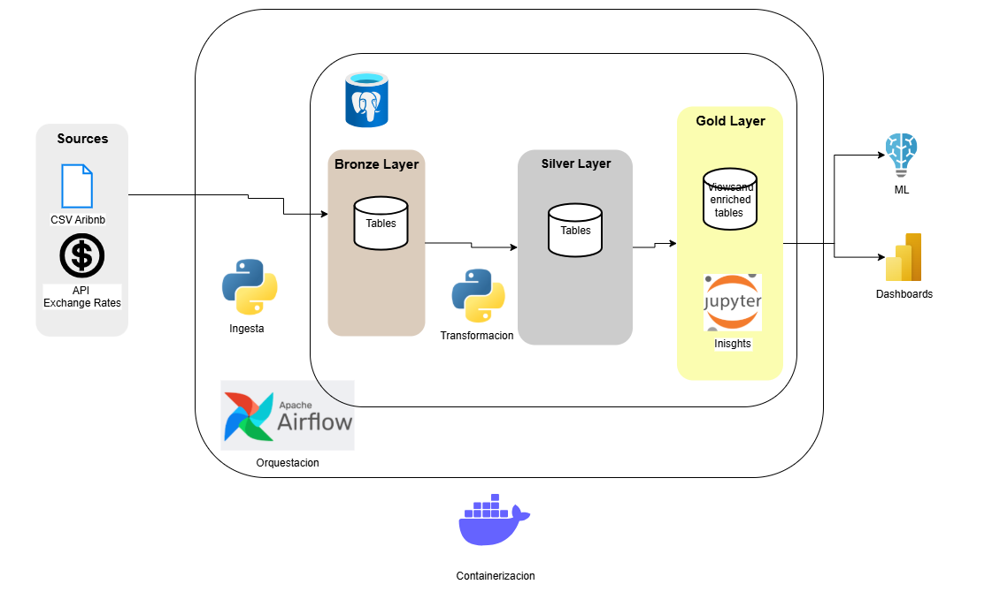

# Documento Técnico del Proyecto de Data Warehouse
## Diagrama de Arquitectura

## 1. Definición de Capas del Data Warehouse

### Capa Bronze
La capa bronze representa la **ingesta cruda de datos** desde las fuentes originales. En este proyecto, se incluyen:
- Un archivo CSV de Airbnb proporcionado por el curso.
- Un endpoint de API de currencies que se consume y se guarda como CSV.

**Propósito:** preservar los datos originales sin transformaciones, permitiendo trazabilidad y auditoría.

**Ventajas:**
- Conservación de la fuente original.
- Facilidad para reprocesar datos si cambian los requerimientos.
- Base para aplicar validaciones y limpieza en capas posteriores.

---

### Capa Silver
La capa silver contiene los datos **limpios, normalizados y validados**. En este proyecto:
- Se normaliza la tabla de Airbnb en 4 entidades: `listings`, `hosts`, `neighbourhoods`, `reviews`.
- Se ajustan los tipos de datos (`VARCHAR`, `DATE`, `NUMERIC`, etc.).
- Se manejan valores nulos y se realiza una verificación de integridad (unicidad de claves, fechas válidas, valores positivos).
- Se transforma la tabla de currencies para integrarla con formato y metadatos adecuados.

**Propósito:** preparar los datos para análisis, asegurando calidad y consistencia.

**Ventajas:**
- Estructura relacional clara y eficiente.
- Datos confiables para análisis y visualización.
- Validaciones automatizadas documentadas.

---

### Capa Gold
La capa gold contiene datos **agregados y optimizados para análisis de negocio y modelos de machine learning**. En este proyecto:
- Se crean tablas resumen (`listing_summary`, `host_summary`, `neighbourhood_summary`).
- Se genera una vista desnormalizada para consumo por dashboards y ML engineers.
- Se desarrolla un dashboard en Jupyter Notebook con visualizaciones clave.

**Propósito:** facilitar el acceso a insights y métricas para usuarios finales.

**Ventajas:**
- Consultas rápidas y orientadas a negocio.
- Soporte para visualizaciones y modelos predictivos.
- Reducción de complejidad para analistas.

---

## 2. Justificación de Herramientas y Tecnologías

| Herramienta       | Rol en el Proyecto | Justificación |
|-------------------|--------------------|---------------|
| **PostgreSQL**    | Base de datos relacional | Escalable, robusto, soporte para schemas y SQL estándar |
| **Docker**        | Contenerización de servicios | Portabilidad, aislamiento, fácil despliegue |
| **Airflow**       | Orquestación de procesos ETL | Automatización, dependencias entre tareas, escalabilidad |
| **SQLAlchemy**    | Conexión y ejecución de SQL desde Python | Abstracción de base de datos, integración con pandas |
| **Jupyter Notebook** | Dashboard y análisis exploratorio | Interactividad, visualización, documentación |
| **Python**        | Transformaciones, validaciones, consumo de API | Versatilidad, ecosistema de librerías, integración con Airflow |

Estas herramientas fueron seleccionadas por su **facilidad de integración**, **rendimiento**, y **adecuación al problema** de construir un pipeline de datos reproducible y escalable.

---

## 3. Análisis de Fuentes de Datos

### CSV de Airbnb
- Contiene información de propiedades, hosts, ubicaciones, precios y reseñas.
- Relevante para responder preguntas como:
  - ¿Qué barrios tienen más propiedades?
  - ¿Qué tipo de habitación es más popular?
  - ¿Qué tan activos son los hosts?

### API de Currencies
- Proporciona tasas de cambio actualizadas para enriquecer los precios en distintas monedas.
- Permite análisis financiero y comparaciones internacionales.

**Valor Analítico:**
- Permite responder preguntas clave del negocio.
- Soporta visualizaciones y modelos predictivos.
- Aporta contexto económico a los datos de propiedades.

---

## 4. Conclusión

Este proyecto implementa una arquitectura de Data Warehouse moderna, con capas bien definidas, herramientas robustas y fuentes de datos relevantes. La estructura permite escalar el análisis, automatizar procesos y entregar valor a analistas y científicos de datos.